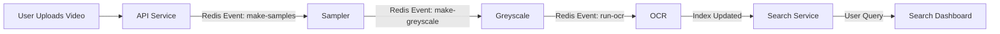

# 🧠 Cortana-Vision — Build & Usage Guide

Cortana-Vision is a modular, AI-powered video understanding pipeline built with FastAPI, Redis, OpenCV, and Tesseract OCR. It automatically processes videos into searchable, structured information by chaining microservices.

---

## 🚀 Overview

**Workflow summary:**

1. **Upload Service (API)** → receives videos and stores them in S3.
2. **Sampler Service** → extracts keyframes using FFmpeg.
3. **Greyscale Service** → converts frames to grayscale for OCR accuracy.
4. **OCR Service** → extracts text from images using Tesseract.
5. **Search Service** → indexes OCR text for fast semantic or keyword search.

Each stage passes jobs to the next using Redis pub/sub events.

---

## 🧩 Service Descriptions

### 1️⃣ API Service (`cortana-api-service`)

**Purpose:** Entry point of the system — handles video uploads.

* Saves the uploaded video temporarily.
* Uploads it to S3 (Hetzner or AWS-compatible).
* Inserts metadata into the database.
* Publishes a Redis event to start sampling.

**Main endpoint:** `POST /upload/`  → Uploads video and queues sampler job.

**Storage:** S3 + SQLite metadata.

---

### 2️⃣ Sampler Service (`cortana-sampler-service`)

**Purpose:** Extracts representative frames from uploaded videos.

* Listens for Redis event `make-samples-from-video`.
* Uses **FFmpeg** to detect scene changes and extract keyframes.
* Deduplicates frames using histogram comparison.
* Uploads frames to S3 and adds entries to the database.
* Publishes greyscale jobs to Redis.

**Output:** S3 folder: `videos/<video_id>/samples/`

---

### 3️⃣ Greyscale Service (`cortana-greyscale-service`)

**Purpose:** Prepares images for OCR by removing noise and converting to grayscale.

* Listens for event `make-greyscale-from-samples`.
* Downloads each frame from S3.
* Converts to grayscale via OpenCV.
* Uploads result to S3 → `videos/<video_id>/greyscaled/`
* Publishes OCR jobs.

**Output:** Grayscale frames stored back on S3.

---

### 4️⃣ OCR Service (`cortana-ocr-service`)

**Purpose:** Extracts readable text from images.

* Listens for event `run-ocr-from-greyscaled-samples`.
* Downloads grayscale images from S3.
* Enhances images using OpenCV + CLAHE.
* Runs OCR using  **Tesseract (English + German)** .
* Stores text results in SQLite (table: `ocr_frames`).
* Publishes `ocr-index-updated` event.

**Output:** Structured OCR text linked to each video frame.

---

### 5️⃣ Search Service (`cortana-search-service`)

**Purpose:** Enables users to browse OCR text and videos.

* FastAPI UI routes: `/dashboard` and `/search?q=...`
* Full-text search using SQLite FTS5.
* Simple HTML + Jinja templates (dashboard, search results, video preview).

**Output:** Web dashboard accessible at `http://<server-ip>:8080`.

---

## 🛠️ Build Instructions

### 1. Clone Repository

```bash
git clone https://github.com/pasogott/cortana-vision.git
cd cortana-vision
```

### 2. Set Environment Variables

Each service uses its own `.env` file. For development, create `.env` at root:

```env
REDIS_URL=redis://cortana-redis:6379/0
DATABASE_URL=sqlite:////app/data/snapshot.db
S3_URL=https://<your-s3-endpoint>
S3_BUCKET=<your-bucket-name>
S3_ACCESS_KEY=<your-key>
S3_SECRET_KEY=<your-secret>
REGION=us-east-1
```

### 3. Build & Start All Services

```bash
docker compose up -d --build
```

**Services started:**

* API → port **8000**
* Search → port **8080**
* Redis → port **6379**

Verify running containers:

```bash
docker ps --format "table {{.Names}}\t{{.Status}}\t{{.Ports}}"
```

---

## 🧪 Test the Pipeline

1. **Upload a video:**

```bash
curl -X POST http://localhost:8000/upload/ \
  -F "file=@/path/to/video.mp4"
```

2. **Sampler extracts frames** → watch logs:

```bash
docker logs -f cortana-sampler
```

3. **Greyscale + OCR run automatically** .
4. **Search the results:**

   Open [http://localhost:8080](http://localhost:8080/) → try a text query.

---

## 🧱 Data Flow Summary



---

## 📦 Technologies Used

| Layer      | Tech                               |
| ---------- | ---------------------------------- |
| Backend    | FastAPI, Redis, SQLite             |
| Processing | OpenCV, FFmpeg, Tesseract          |
| Storage    | Hetzner / AWS S3-compatible bucket |
| Deployment | Docker Compose                     |

---

## 🧰 Developer Notes

* Each microservice is isolated with its own `pyproject.toml` and Dockerfile.
* All inter-service communication is event-driven via Redis.
* Database schema is lightweight (one shared `snapshot.db`).
* Logs print detailed job progress for observability.

---

## 🧭 Quick Reference

| Service   | Port | Key Job             | Source Folder                  |
| --------- | ---- | ------------------- | ------------------------------ |
| API       | 8000 | Upload + queue jobs | `cortana-api-service/`       |
| Sampler   | —   | Frame extraction    | `cortana-sampler-service/`   |
| Greyscale | —   | Image cleanup       | `cortana-greyscale-service/` |
| OCR       | —   | Text extraction     | `cortana-ocr-service/`       |
| Search    | 8080 | UI + FTS search     | `cortana-search-service/`    |

---

## 🧹 Cleanup

Stop and remove containers:

```bash
docker compose down
```

Remove local data (if safe):

```bash
rm -rf data uploads
```

---

### ✅ Summary

Cortana-Vision is a modular, production-ready video-to-text pipeline. Each microservice plays a specific role in converting uploaded videos into searchable OCR data. Running the full stack locally replicates a complete computer vision workflow — from raw video → structured insight → web search.
